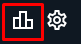
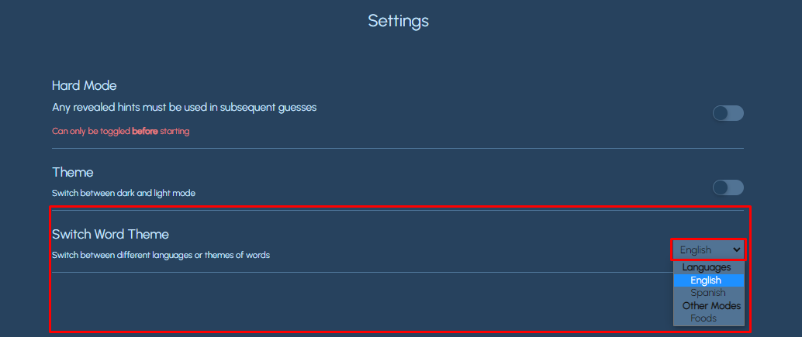
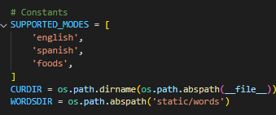
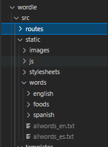

# Wordle Clone

Created using Flask and VanillaJS, this clone includes not only english words but has the option to switch to spanish words and food-related words

## Installation

Use the package manager [pip](https://pip.pypa.io/en/stable/) to install the following dependencies

- flask
- flask_wtf

Then, change your directory to the `/wordle/src` directory. To start, type

```bash
python app.py
```
And you're finished!

## How to play

If you have ever played wordle before, this is the exact same! Just guess any 5-letter word and if any letter turns green, that letter is **in the word** and **in the correct spot**. If any letter turns yellow, that letter is **in the word** *but* **not in the correct spot**. If any letter turns grey, that letter is **not in the word**.

<br/>
<br/>

To view your statistics, click the statistics icon in the top right 

To change your word mode, click the settings icon in the top right , go to the `Switch Word Theme` setting  and click on the dropdown.


## Additionally
If you would like to add more languages or modes

1. Add your mode to the `SUPPORTED_MODES` constant

    

2. Add your words list to the `/wordle/src/static/words` directory

    

3. Add your option to the HTML

    